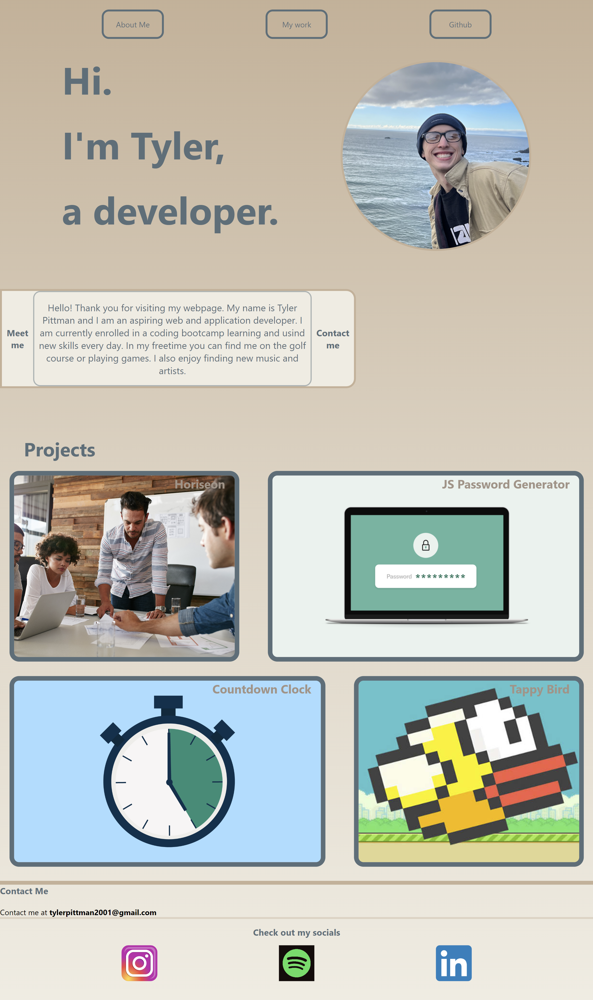

# <a href="https://psiko23.github.io/My-Landing-Page/" target="_blank">My-Landing-Page</a>

Thank you for checking out my landing page! I created this to use as my portfolio as I begin building new things. Here you will find projects that I have completed, a short bio, and ways to contact me. 

## What I learned

This project forced me to do research. When I began I was a bit lost, but I problem solved and acheived what I was going for. This code is a bit messy, but I can use what I learned here and do better next time.

## Website Screenshot

